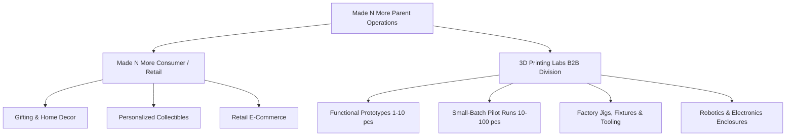
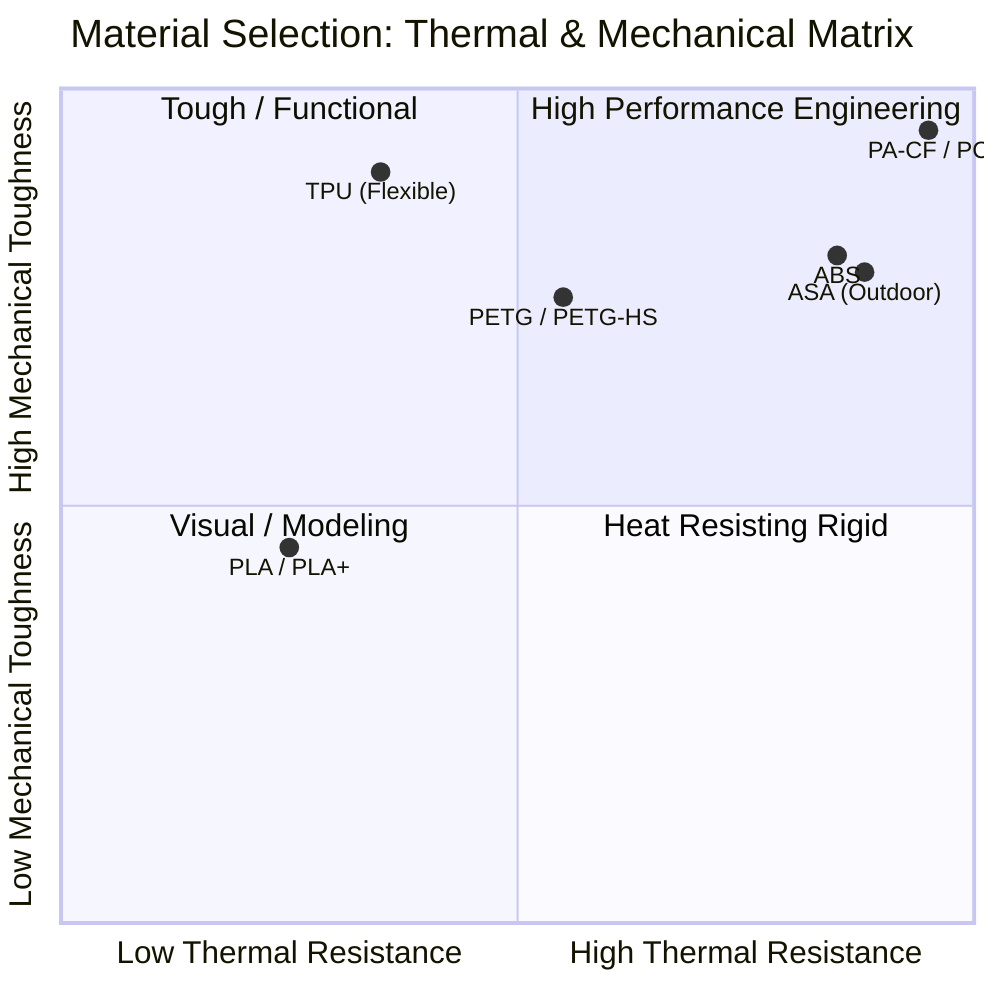
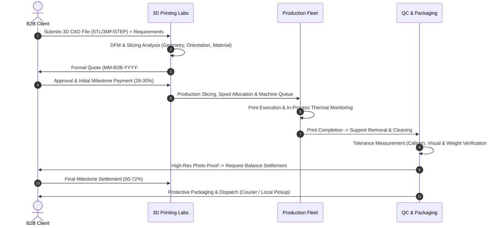
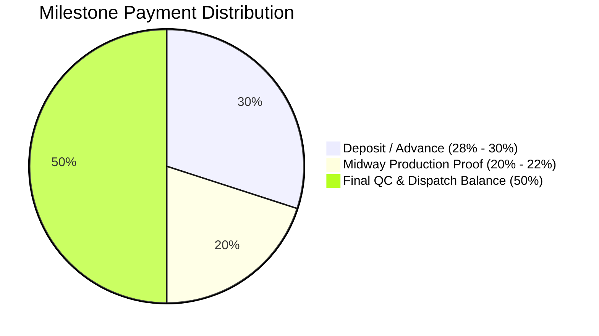
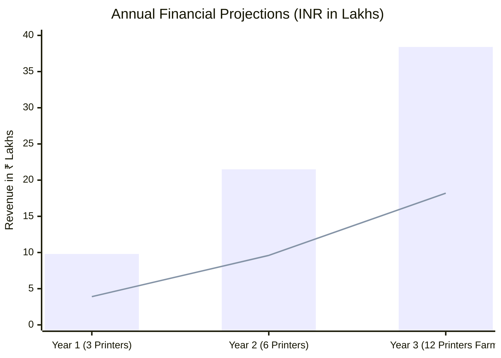

# 🏭 3D PRINTING LABS — COMPREHENSIVE BUSINESS PLAN
### B2B Digital Manufacturing, Rapid Prototyping & Small-Batch Production
**Parent Brand:** Made N More | **Location:** Pune, Maharashtra, India  
**Tagline:** *You Design. We Manufacture.*  
**Version:** 1.0 (2026–2028 Strategic Plan)

---

## 📑 TABLE OF CONTENTS
1. [Executive Summary](#1-executive-summary)
2. [Company Profile & Strategic Identity](#2-company-profile--strategic-identity)
3. [Market Opportunity & Target Segments](#3-market-opportunity--target-segments)
4. [Services & Production Capabilities](#4-services--production-capabilities)
5. [Operational Workflow & Quality Control](#5-operational-workflow--quality-control)
6. [Sales, Marketing & Go-To-Market Strategy](#6-sales-marketing--go-to-market-strategy)
7. [Commercial Rules, Pricing Architecture & Milestone Billing](#7-commercial-rules-pricing-architecture--milestone-billing)
8. [Financial Plan & Projections (Years 1–3)](#8-financial-plan--projections-years-13)
9. [Risk Analysis & Operational Safeguards](#9-risk-analysis--operational-safeguards)
10. [Scale-Up & Hardware Roadmap](#10-scale-up--hardware-roadmap)

---

## 1. EXECUTIVE SUMMARY

### 1.1 The Business
**3D Printing Labs** is a specialized B2B digital manufacturing and rapid prototyping service founded under the Made N More umbrella, headquartered in Pune, Maharashtra. The enterprise converts customer-provided 3D/CAD models into high-precision, production-grade physical parts without the prohibitive tooling costs, lengthy steel mold lead times, or massive minimum order quantities (MOQs) associated with traditional injection molding and CNC machining.

### 1.2 Core Value Proposition
> **"YOU DESIGN. WE MANUFACTURE."**  
We eliminate the friction between digital CAD concepts and physical reality for engineering teams, startups, and manufacturers requiring 1 to 100+ end-use parts, functional prototypes, and custom tooling in 24 to 72 hours.

### 1.3 Key Differentiators
- **Strict Scope Focus**: Unlike design agencies with long turnaround times, 3D Printing Labs does not provide slow, open-ended CAD modeling services. By accepting customer-ready 3D files (STL, 3MF, STEP, OBJ), turnaround times from file receipt to active manufacturing are reduced to hours.
- **Industrial FDM Production Setup**: Anchored on high-reliability, multi-material platforms (including the Snapmaker U1 ecosystem), capable of tight tolerances, multicolor builds, and functional engineering materials (PETG-HS, ABS, TPU, PLA+).
- **Milestone Installment Commercial Model**: Client risk is minimized through transparent milestone billing (e.g. 28% advance deposit, 22% midway production proof, 50% upon final QC and dispatch), integrated directly with the Made N More management system.
- **Strategic Industrial Geography**: Centered in Pune, granting immediate access to India's premier industrial and automotive manufacturing corridors (Bhosari MIDC, Chakan, Ranjangaon) and hardware startup hubs (Hinjewadi, Kharadi).

---

## 2. COMPANY PROFILE & STRATEGIC IDENTITY

### 2.1 Brand Segmentation
To maximize commercial positioning and protect brand equity, operations are segmented into two distinct brand identities:
- **Made N More**: Consumer-facing identity focused on customized lifestyle products, personalized gifts, 3D collectibles, and creative retail merchandise.
- **3D Printing Labs**: Professional B2B digital manufacturing division serving corporate clients, industrial R&D teams, robotics startups, and manufacturing plants with a focus on engineering specifications, tolerances, and confidentiality.



### 2.2 Scope Boundaries & Operating Philosophy
To maintain high machine utilization and eliminate communication bottlenecks:
- **Customer Supplies Model**: The customer is responsible for providing valid 3D geometry.
- **Manufacturability Checks (DFM)**: 3D Printing Labs performs basic slicing orientation, support requirement analysis, and wall-thickness printability assessments.
- **No CAD Bottlenecks**: Avoid custom scratch CAD drafting, preventing open-ended creative revisions and keeping machine capacity dedicated to billable production hours.

---

## 3. MARKET OPPORTUNITY & TARGET SEGMENTS

### 3.1 Industry Drivers
1. **Proliferation of Hardware & IoT Startups**: Accelerating electronics and robotics innovation in India requires physical enclosures and brackets before raising capital or finalizing injection tooling.
2. **Prohibitive Injection Mold Costs**: Steel and aluminum molds cost between ₹1,50,000 to ₹10,00,000+ with 4–8 week lead times. 3D Printing Labs delivers pilot batches of 50–100 units for under ₹15,000 within 3 days.
3. **Agile Factory Tooling**: Machine shops and assembly lines require custom jigs, replacement gears, and holding fixtures overnight to prevent assembly line stoppages.

### 3.2 Target Customer Profiles

| Customer Segment | Typical Use Case | Primary Materials | Key Purchase Driver |
| :--- | :--- | :--- | :--- |
| **Electronics & IoT Startups** | Custom sensor housings, PCB enclosures, snap-fit lids | ABS, PETG, PLA | Fast iteration speed, aesthetic surface finish |
| **Robotics & Automation Teams** | Motor brackets, arm linkages, gripper fingers, cable guides | PETG-HS, ABS, Nylon | Mechanical rigidity, impact resistance, light weight |
| **Industrial / MIDC Suppliers** | Assembly jigs, drill guides, inspection fixtures, testing nests | ABS, PETG | Same-week delivery, zero minimum quantities |
| **Product Designers & R&D Units** | Ergonomic handle prototypes, concept mockups, visual models | PLA+, Multicolor | Geometric fidelity, color options, low unit cost |
| **Small Manufacturers** | Low-volume replacement parts, legacy machine components | PETG, TPU | Bypassing discontinued OEM spare parts |

### 3.3 Geographic Target Corridor (Pune Industrial Base)
- **Bhosari MIDC & Pimpri-Chinchwad**: Industrial automation, precision tooling, and machine builders.
- **Chakan Auto Hub**: Tier-1 and Tier-2 automotive component suppliers needing prototyping and validation.
- **Ranjangaon Industrial Zone**: Large consumer durable and engineering assembly plants.
- **Hinjewadi & Kharadi Hardware Tech Hubs**: Deep-tech startups, IoT devices, medical device prototypes.
- **Academic Incubators (COEP, MIT-WPU, Pune University)**: Student hardware ventures and research labs.

---

## 4. SERVICES & PRODUCTION CAPABILITIES

### 4.1 Production Portfolio
1. **Functional Prototypes (1–5 Units)**: Fit-check, form verification, and functional stress testing before committing to volume manufacturing.
2. **Small-Batch Pilot Runs (10–100+ Units)**: Production bridge manufacturing for market testing, beta client deployments, and early customer deliveries.
3. **Custom Electronics Enclosures**: Heat-resistant, snap-fit, or threaded-insert housings designed for custom PCBs.
4. **Jigs, Fixtures & Tooling Aids**: Specialized manufacturing aids that accelerate manual assembly lines in local factories.
5. **Multicolor & Multi-Material FDM Parts**: Dual-color labeling, warning indicators, and combined rigid/flexible geometries using the Snapmaker U1 ecosystem.

### 4.2 Material Selection Matrix



- **PLA / PLA+ (General Prototyping)**: Optimal dimensional stability, high aesthetic appeal, minimal shrinkage. Ideal for presentation mockups, visual fit verification, and rapid proof-of-concept parts.
- **PETG / PETG-HS (Mechanical Utility)**: Outstanding layer adhesion, high chemical and moisture resistance, superior impact absorption. Ideal for robotics brackets, snaps, and mechanical components.
- **ABS (Thermal & Industrial Strength)**: Heat resistance up to 95°C–100°C, ductile failure modes, machinable and post-processable. Ideal for enclosures, automotive interior parts, and under-hood test units.
- **TPU (Elastomeric Flexibility)**: High elasticity, shock absorption, abrasion resistance. Ideal for vibration dampeners, gaskets, protective bumpers, and robotic grippers.
- **ASA & Engineering Grades (Future Validation)**: UV-stable exterior parts and fiber-reinforced polymers for heavy mechanical loads.

---

## 5. OPERATIONAL WORKFLOW & QUALITY CONTROL



### 5.1 Quality Control (QC) Protocols
- **First-Off Inspection**: On multi-part orders (10+ units), the first printed unit is measured against CAD nominal dimensions using digital vernier calipers before the full batch is cleared.
- **Orientation Optimization**: Critical functional features (e.g. cantilever snaps, screw bosses) are sliced with layer lines parallel to primary stress vectors to eliminate delamination risks.
- **Weight Consistency Verification**: Completed parts are weighed on a precision gram scale against the sliced software estimate to detect internal under-extrusion or structural void defects.

### 5.2 Scrap & Failure Mitigation
- **Filament Dehumidification**: Hygroscopic filaments (PETG, TPU, ABS) stored in active dryboxes at <15% relative humidity to prevent hydrolysis-induced brittle layers.
- **Power Outage Protection**: Hardware backed by inverter/UPS units to eliminate print loss during local power fluctuations.
- **Failed Print Ledger**: Scrap mass is logged directly into the Made N More inventory system to trace material failure rates across vendors and colors.

---

## 6. SALES, MARKETING & GO-TO-MARKET STRATEGY

### 6.1 The 30-Day B2B Client Acquisition Engine
Adapted directly from the B2B Sales Kit:

```text
┌─────────────────┐      ┌─────────────────┐      ┌─────────────────┐      ┌─────────────────┐
│    DAYS 1–7     │ ───► │    DAYS 8–14    │ ───► │   DAYS 15–21    │ ───► │   DAYS 22–30    │
├─────────────────┤      ├─────────────────┤      ├─────────────────┤      ├─────────────────┤
│• Finalize Kit   │      │• 35 Targeted    │      │• 30+ Follow-ups │      │• Account Review │
│• 25 Prospects   │      │  LinkedIn/Emails│      │• Fast Quotes    │      │• Referral Asks  │
│• Build Demo Box │      │• 5 MIDC Visits  │      │• First Orders   │      │• Repeat Orders  │
└─────────────────┘      └─────────────────┘      └─────────────────┘      └─────────────────┘
```

### 6.2 The Industrial "Sample Box" Strategy
When visiting engineering heads and procurement managers in Bhosari MIDC and Chakan, the sales representative presents a curated tactile **Sample Box**:
1. **ABS Housing**: Demonstrates thermal resilience, smooth wall finish, and snap-fit accuracy.
2. **PETG Motor Bracket**: Demonstrates mechanical structural strength, rigid infill, and bolt-hole tolerances.
3. **Multicolor Snapmaker U1 Component**: Showcases advanced dual-material and color differentiation for logos/warnings.
4. **TPU Flexible Gasket**: Demonstrates shore-hardness flexibility and abrasion resistance.
5. **Batch of 10 Identical Small Parts**: Visually proves unit-to-unit consistency in small-batch manufacturing.

### 6.3 Sales Script & Conversion Funnel
- **30-Second Elevator Pitch**:
  > *"We are 3D Printing Labs, a Pune-based digital manufacturing studio. We produce functional prototypes, brackets, enclosures, and small batches directly from your existing 3D files. If your team ever needs 1 to 100 parts without the tooling costs or 4-week delays of traditional suppliers, send us the model and we'll quote it in hours."*
- **Qualification Triad**:
  1. *Do you have 3D/CAD files ready?*
  2. *Is the part visual or functional (load, heat, outdoor exposure)?*
  3. *What is your required batch size and delivery deadline?*
- **Risk-Reversal Incentive**: Free printability check and first-order optimization review rather than damaging price discounting.

### 6.4 Objection Handling Playbook

| Client Objection | Strategic Counter-Response |
| :--- | :--- |
| *"We already have an in-house 3D printer."* | *"We act as your on-demand overflow capacity when your printer is backed up with queue, when you need 20+ parts fast, or when you need materials your setup doesn't run."* |
| *"Your per-part price is higher than mass injection molding."* | *"Injection molding requires ₹2,00,000 in upfront steel tooling and 6 weeks of waiting. For 1 to 100 pieces, our zero-tooling digital route saves you over 80% total capital and delivers this week."* |
| *"We only need a single piece."* | *"One-off functional prototypes are our core foundation. Send over the STEP or STL file and we'll turn it around immediately."* |
| *"Can you guarantee structural strength?"* | *"Strength depends on geometry, load orientation, and polymer choice. We will orient the build along your stress axes and recommend PETG or ABS to meet your operational load."* |

---

## 7. COMMERCIAL RULES, PRICING ARCHITECTURE & MILESTONE BILLING

### 7.1 Multi-Variable Quoting Formula
Prices are calculated using the full production cost formula rather than simplistic weight-only rates:

$$\text{Quote Total} = (\text{Material Mass} \times C_{\text{gram}}) + (\text{Machine Time (hrs)} \times R_{\text{hour}}) + C_{\text{setup}} + C_{\text{finish}} + C_{\text{shipping}} + \text{Tax}$$

Where:
- $C_{\text{gram}}$ = Base material cost per gram + drying/waste factor ($1.15 \times \text{Raw Cost}$).
- $R_{\text{hour}}$ = Machine hourly rate (Electricity ₹10–12/hr + machine depreciation ₹25/hr + maintenance reserves ₹15/hr + baseline shop overhead).
- $C_{\text{setup}}$ = CAD verification, build plate prep, slicing, file staging (₹150 – ₹300 per build setup).
- $C_{\text{finish}}$ = Support cleanup, brim removal, heat-set threaded insert installation.

### 7.2 Percentage-Based Milestone Billing Structure
To protect cash flow and ensure customer confidence on multi-thousand rupee orders, 3D Printing Labs implements a milestone installment structure managed via the Made N More system:



1. **Milestone 1: 28% – 30% Advance Deposit**
   - Trigger: Order confirmation.
   - Purpose: Locks machine production schedule and allocates dedicated spools from inventory.
2. **Milestone 2: 20% – 22% Midway Proof**
   - Trigger: First 30% of batch completed or initial prototype functional fit verified via video/photos.
   - Purpose: Validates client satisfaction with surface finish and geometry before full-capacity run.
3. **Milestone 3: 50% Final Settlement**
   - Trigger: Final batch QC inspection complete, parts boxed for dispatch.
   - Purpose: Zero credit risk upon handover.

---

## 8. FINANCIAL PLAN & PROJECTIONS (YEARS 1–3)

### 8.1 Capital Expenditure (CapEx) & Initial Setup

| Item | Specification / Model | Units | Unit Cost (₹) | Total (₹) |
| :--- | :--- | :---: | :---: | :---: |
| **Primary Production Machine** | Snapmaker U1 Multi-Material Platform | 1 | 95,000 | 95,000 |
| **High-Speed Support Printers** | Fast CoreXY FDM Units (Bambu/Creality K1) | 2 | 55,000 | 1,10,000 |
| **Material Dryers & Storage** | Heated Dual-Spool Dryboxes + Vacuum Seals | 3 | 7,500 | 22,500 |
| **Quality & Post-Processing Tools** | Mitutoyo Calipers, Deburring set, Heat-insert press | 1 | 18,000 | 18,000 |
| **UPS & Electrical Power Backup** | 2kVA Pure Sine Wave Inverter + Battery | 1 | 35,000 | 35,000 |
| **Initial Inventory Stock** | 35 Spools (PLA+, PETG-HS, ABS, TPU) | 35 | 1,200 | 42,000 |
| **Total Initial CapEx** | | | | **₹3,22,500** |

### 8.2 Three-Year Projections (Conservative Estimate)



| Financial Metric | Year 1 (Foundational) | Year 2 (Expansion) | Year 3 (Scaled Farm) |
| :--- | :---: | :---: | :---: |
| **Active Machine Fleet** | 3 Printers | 6 Printers | 12 Printers |
| **Avg. Machine Utilization** | 45% (3,900 hrs/yr) | 60% (10,500 hrs/yr) | 70% (24,500 hrs/yr) |
| **Average Order Value (AOV)**| ₹3,200 | ₹4,800 | ₹6,500 |
| **Total Annual Revenue** | **₹9,80,000** | **₹21,50,000** | **₹38,40,000** |
| **Direct Material & Power Costs** | ₹2,45,000 | ₹5,15,000 | ₹8,80,000 |
| **Shop Overheads, Maintenance & Spares** | ₹1,20,000 | ₹2,40,000 | ₹4,20,000 |
| **Operator / Labor Allocation** | ₹2,25,000 | ₹4,35,000 | ₹7,20,000 |
| **Gross Contribution Margin** | **62.7%** | **65.1%** | **66.1%** |
| **Net Pre-Tax Profit** | **₹3,90,000** | **₹9,60,000** | **₹18,20,000** |

---

## 9. RISK ANALYSIS & OPERATIONAL SAFEGUARDS

```text
┌───────────────────────┬─────────────────────────────────────────────────────────────────────────┐
│ Risk Factor           │ Operational Mitigation Protocol                                         │
├───────────────────────┼─────────────────────────────────────────────────────────────────────────┤
│ Customer CAD Errors   │ Strict DFM disclaimer; client signs off that prints mirror provided     │
│                       │ geometry. File reprints due to client revision are chargeable.          │
├───────────────────────┼─────────────────────────────────────────────────────────────────────────┤
│ Machine Downtime      │ Standardized spare nozzles, belts, thermistors, and extruder parts kept │
│                       │ on-site. Redundant printers prevent single-point-of-failure delays.    │
├───────────────────────┼─────────────────────────────────────────────────────────────────────────┤
│ Material Degradation  │ Continuous hygrometer monitoring inside sealed storage dry-boxes;       │
│                       │ filament baked in dehumidifiers before all critical ABS/PETG/TPU runs.  │
├───────────────────────┼─────────────────────────────────────────────────────────────────────────┤
│ Client Default / Bad  │ 28-30% initial deposit required before machine starts; final shipment   │
│ Debt                  │ released only upon full milestone settlement.                           │
└───────────────────────┴─────────────────────────────────────────────────────────────────────────┘
```

---

## 10. SCALE-UP & HARDWARE ROADMAP

### Phase I: Foundation (Months 1–6)
- Stabilize operations with 3 core FDM machines centered on Snapmaker U1 and CoreXY production units.
- Establish baseline accounts with 15 recurring B2B clients in Bhosari and Hinjewadi.
- Integrate all invoicing and milestone installment tracking through the Made N More internal ERP.

### Phase II: Automation & Tooling (Months 7–18)
- Expand to 6 dedicated high-speed enclosed printers with automated plate-clearing systems.
- Introduce resin 3D printing (MSLA/SLA) for micro-precision electronics connectors and medical housings.
- Deploy physical spool QR scanning and automated gram-deduction linked to print slicer outputs.

### Phase III: The Distributed Farm (Months 19–36)
- Expand fleet to a 12–16 printer digital manufacturing hub.
- Implement an automated Web-to-Print instant quote portal where clients upload STEP/STL files and receive real-time quotes based on volume, infill, and material selection.
- Establish specialized aerospace and high-performance capabilities with continuous-fiber or PEEK/Ultem printing.

---

*Authored for: 3D Printing Labs / Made N More Management*  
*Operating Headquarters: Pune, Maharashtra, India*
