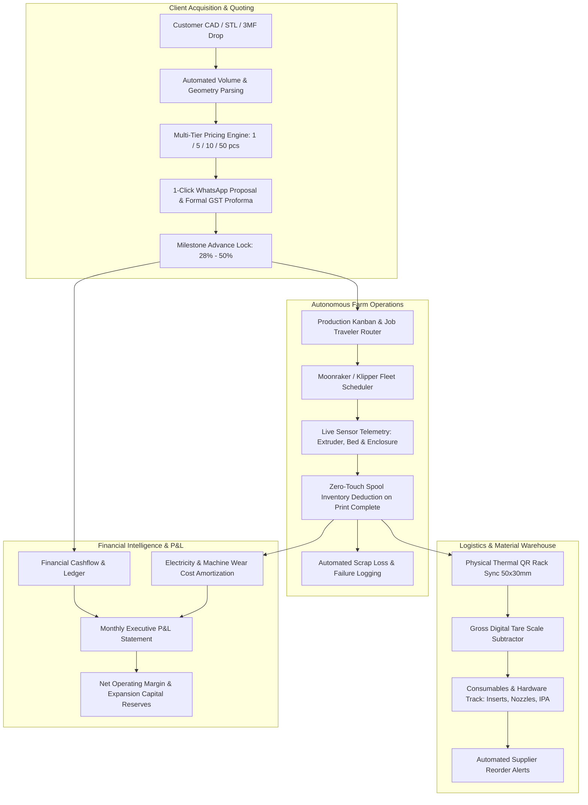

# 🗺️ Made N More & 3D Printing Labs — Master Strategic Roadmap & Industrial OS Blueprint
### The Next-Generation Manufacturing Executive System (MES) & Farm Scaling Engine
**Document Version:** 6.0 (Active Workshop Suite & Strategic Horizons)  
**Target Operator:** Business Owner, Farm Manager & Production Technicians  
**Core Purpose:** Automate all administrative, quoting, hardware telemetry, material tracking, and banking overhead so the owner can operate the workshop with zero friction and maximum profitability.

---

## 🎯 Executive Vision: The Operator's Unfair Advantage

Made N More / 3D Printing Labs is positioned as Pune's premier B2B digital manufacturing and rapid prototyping service. Our competitive moat is **velocity, precision, and zero administrative waste**.



---

## 🗓️ Master Phased Roadmap

### 🟢 Immediate Workshop Operational Horizons (Phases 1 – 4: Active & Production Ready)

```text
┌────────────────────────────────────────────────────────────────────────────────────────┐
│ PHASE 1 (Delivered): Production Kanban Pipeline & Milestone Billing                   │
│ • Multi-item part assemblies under one order                                           │
│ • 8-Stage visual Kanban board with drag & drop                                         │
│ • GST Tax Invoicing (SAC 9988 / HSN 3916) with A4 PDF print view                       │
│ • Milestone installment receipt vouchers (28% deposit, 22% proof, 50% final)           │
└────────────────────────────────────────────────────────────────────────────────────────┘
                                    │
                                    ▼
┌────────────────────────────────────────────────────────────────────────────────────────┐
│ PHASE 2 (Delivered): Snapmaker U1 Moonraker / Klipper Full Control Suite & Farm Hub    │
│ • Snapmaker U1 Direct LAN Moonraker Bridge (live nozzle/bed telemetry, port 80)        │
│ • Server-Side Proxy Fallback: Zero CORS restrictions across LAN/Wi-Fi devices          │
│ • Interactive Jog D-Pad (0.1, 1, 10, 50, 100mm steps), Z-lift column, and Home controls│
│ • Emergency Stop M112: Instant halt for all heaters and motion steppers                │
│ • Thermal & Extrusion Center: Target temp sliders, PLA/PETG/ABS presets, fan speed     │
│ • Filament Feed Drive: Extrude 10mm/50mm (purge) and Retract 10mm/50mm (unload)        │
│ • Interactive G-Code Terminal Console: Command history, macro chips, live response log │
│ • Virtual SDCard File Launcher: List gcodes on printer storage with 1-click start job  │
│ • Live Camera Snapshot & Timelapse MP4 Bulk Downloader with sequential progress        │
└────────────────────────────────────────────────────────────────────────────────────────┘
                                    │
                                    ▼
┌────────────────────────────────────────────────────────────────────────────────────────┐
│ PHASE 3 (Delivered): Multi-Account Treasury & Banking Suite                           │
│ • Actual Real-World Account Balances: Current A/c, Workshop UPI, Cash Drawer, Sinking  │
│ • Inter-Account Funds Transfer modal with balance validation and audit trail           │
│ • Bank Statement Reconciliation modal: Quick adjust to match physical statement        │
│ • Executive Treasury Ribbon: Total Liquid Capital, Inflows, Outflows, and Net Cash Flow│
│ • Chronological Treasury Ledger: Categorized audit log with receipt and invoice tags   │
│ • Executive top bar liquid balance badge for continuous cash visibility                │
└────────────────────────────────────────────────────────────────────────────────────────┘
                                    │
                                    ▼
┌────────────────────────────────────────────────────────────────────────────────────────┐
│ PHASE 4 (Delivered): Workshop Spool Tare & Physical Lab Logistics                      │
│ • Digital Scale Spool Tare Tool: Exact usable filament calculation subtracting spool   │
│ • Live Job Feasibility & Parts Yield Calculator: Prevents mid-print runouts            │
│ • Printable Workshop Job Traveler Card (📋): A4 QC checklist & router for shop floor   │
│ • Zero-Touch Spool Deduction: Auto-decrements grams on print complete                  │
│ • Universal Scrap Loss & Defect Logger: Deducts wasted filament & debits ledger loss   │
│ • Fleet Hub Scrap Loss KPI Ribbon: Real-time defect loss and wasted mass visibility    │
│ • Thermal QR Label Generation (50x30mm) for spool storage racks and bin organization   │
│ • Workshop hardware tracking & fast pull: Brass heat-set inserts (M2–M5), nozzles, IPA │
└────────────────────────────────────────────────────────────────────────────────────────┘
```

---

### 🔭 Distant Strategic Horizons (Phases 5 – 8: Long-Term Growth Plans)
> **Note on Phases 5 to 8:** These phases represent long-term strategic enhancements planned for when the fleet scales to 8+ machines and team size expands beyond direct operator oversight.

```text
┌────────────────────────────────────────────────────────────────────────────────────────┐
│ PHASE 5 (Distant Plan): Deep Financial Intelligence & Cost Accounting Engine           │
│ • Granular Job Costing Breakdown: Material + Electricity + Machine Wear + Labor Buffer │
│ • Multi-Tier Volume Discount Matrix (1, 5, 10, 25, 50 pcs with price-per-part curves) │
│ • Monthly automated Profit & Loss statements (Gross Sales vs Material vs Power vs Net) │
│ • Machine depreciation & wear reserves allocation (amortizing ₹55,000 capital asset)   │
│ • Material consumption forecasting (reorder alerts before peak production runs dry)    │
│ • Suggested Addition: Automated GST filing export (GSTR-1 summary for CA/accountant)   │
└────────────────────────────────────────────────────────────────────────────────────────┘
                                    │
                                    ▼
┌────────────────────────────────────────────────────────────────────────────────────────┐
│ PHASE 6 (Distant Plan): Automated Quotation Engine, Geometry DFM Analyzer & Slicing AI │
│ • Direct STL Geometry analysis (bounding box, surface area, volume, mass estimate)     │
│ • Design For Manufacturability (DFM) warnings: minimum wall thickness, overhang angles │
│ • Material Recommendation Engine (e.g. recommending PETG-HS over PLA for outdoors)    │
│ • 1-Click Formal Commercial PDF Proforma Quotation with custom B2B terms               │
│ • Suggested Addition: OrcaSlicer / PrusaSlicer headless remote slicing CLI worker      │
└────────────────────────────────────────────────────────────────────────────────────────┘
                                    │
                                    ▼
┌────────────────────────────────────────────────────────────────────────────────────────┐
│ PHASE 7 (Distant Plan): Autonomous Farm Scheduler & Klipper Queue Daemon               │
│ • Centralized Print Queue Dispatcher: Automatically routes queued jobs to idle printer │
│ • Auto-Preheat on Job Assignment: Wakes up bed/nozzle heaters 5 minutes prior to print │
│ • Print Bed Ejection / Conveyor support for continuous unattended batch production     │
│ • Multi-printer power load balancer (prevents tripping workshop breaker during heatup) │
│ • Suggested Addition: AI-powered optical failure detection via webcam (spaghetti/blob) │
└────────────────────────────────────────────────────────────────────────────────────────┘
                                    │
                                    ▼
┌────────────────────────────────────────────────────────────────────────────────────────┐
│ PHASE 8 (Distant Plan): Enterprise Scaling, B2B Client Portal & Secure File Vault      │
│ • Private white-labeled client link: Clients can upload CAD files under mutual NDA     │
│ • Live stage tracker without revealing internal machine IPs or farm secrets            │
│ • Instant re-order button for previously verified production batches                   │
│ • Automated delivery note & courier tracking integration (Shiprocket / Bluedart)       │
│ • Suggested Addition: Multi-tenant workshop permissions (Technician vs Owner view)     │
└────────────────────────────────────────────────────────────────────────────────────────┘
```

---

## 💰 Commercial Pricing Architecture & Unit Economics Formula

To maintain a **60% to 75% gross profit margin** while remaining extremely competitive against industrial injection molders and local bureaus, all jobs are priced using our standardized cost equation:

$$\text{Final Part Quote} = \left[ (\text{Mass} \times C_{\text{mat}}) + (\text{Time} \times C_{\text{elec}}) + (\text{Time} \times C_{\text{wear}}) + C_{\text{prep}} \right] \times M_{\text{margin}} \times D_{\text{volume}}$$

### Where:
1. **$C_{\text{mat}}$ (Raw Filament Cost per Gram)**:
   - PLA+ (Numakers): $\approx ₹0.90 / \text{g}$
   - PETG-HS (High Speed): $\approx ₹1.10 / \text{g}$
   - ABS Engineering: $\approx ₹1.20 / \text{g}$
   - TPU+ Flexible: $\approx ₹1.60 / \text{g}$
   - PLA Silk / Dual: $\approx ₹1.30 / \text{g}$
   - PLA Matte: $\approx ₹1.10 / \text{g}$
2. **$C_{\text{elec}}$ (Electricity Cost per Hour)**:
   - Average 350W printer draw at Pune MSEDCL commercial tariff ($₹8.50 / \text{kWh}$):
   - $0.35\text{ kW} \times ₹8.50 = ₹2.98 \approx ₹3.00 / \text{hr}$
3. **$C_{\text{wear}}$ (Machine Wear & Depreciation Reserve)**:
   - Amortizing a ₹55,000 printer over 3,000 operational hours + maintenance:
   - $₹55,000 / 3,000\text{h} \approx ₹18.33 / \text{hr}$
4. **$C_{\text{prep}}$ (Slicing, Machine Setup & Post-Processing Buffer)**:
   - Flat ₹50 to ₹100 per production plate setup.
5. **$M_{\text{margin}}$ (Owner Margin Multiplier)**:
   - Standard Commercial: $2.5\times$ to $3.0\times$ (equivalent to 150%–200% markup).
   - High-Speed / Overnight Emergency: $3.5\times$ to $4.0\times$.
6. **$D_{\text{volume}}$ (Batch Volume Tier Discount Curve)**:
   - $1\text{ to }4\text{ units}$: $1.00$ ($0\%$ discount)
   - $5\text{ to }9\text{ units}$: $0.90$ ($10\%$ discount)
   - $10\text{ to }24\text{ units}$: $0.85$ ($15\%$ discount)
   - $25\text{ to }49\text{ units}$: $0.80$ ($20\%$ discount)
   - $50+\text{ units}$: $0.75$ ($25\%$ volume production discount)

---

## 🖨️ Hardware Fleet Scale-Up Roadmap

| Stage | Fleet Composition | Capacity | Primary Capability | Target Monthly Revenue |
| :--- | :--- | :--- | :--- | :--- |
| **Current (Stage 1)** | 1x Snapmaker U1 Dual, 1x Voron 2.4, 1x Bambu P1S, 1x Ender 3 | 4 Machines | Multicolor PLA/PETG/ABS, Rapid Prototypes | ₹50,000 – ₹1,20,000 |
| **Stage 2 (Expansion)** | +2x Bambu Lab X1-Carbon AMS, +1x Voron 350mm | 7 Machines | High-temperature ABS/Nylon-CF, Carbon fiber robotics | ₹1,50,000 – ₹3,00,000 |
| **Stage 3 (Pilot Factory)** | +1x Industrial Formlabs Form 4 SLA, +1x Conveyor Continuous Bed | 10 Machines | High-detail resin, continuous pilot runs (500+ pcs) | ₹4,00,000 – ₹7,50,000 |
| **Stage 4 (Digital Hub)** | 15+ CoreXY Farm + In-House SLS Nylon Polymer | 15+ Machines | True production manufacturing replacing small injection molds | ₹10,00,000+ |

---

## 🛡️ Technical Architecture & HomeLab Server Integrity

- **Frontend Core**: Vanilla ES6+, CSS3 Glassmorphism tokens, reactive in-memory client store with optimistic UI updates.
- **Backend API Server**: Node.js + Express 5 running on `0.0.0.0:4000`, persisting JSON ACID state to `src/data/persisted.json`.
- **Physical Hardware Connectors & Universal Fleet Matrix**:
  - **Tier 1 (Covers ~85% of Modern Machines)**:
    - **Moonraker (Klipper)**: Snapmaker U1, Voron 2.4, Creality K1/K1 Max, Elegoo Neptune 4. Direct JSON-RPC/REST telemetry (`/printer/objects/query`), G-code execution (`/printer/gcode/script`), virtual SD card streaming, and native chamber temp monitoring.
    - **OctoPrint (Marlin / RepRap)**: Creality Ender 3, CR-10, Prusa MK3S, Anycubic, Artillery. REST API (`/api/printer`, `/api/job`, `/api/command`) proxy with temperature normalization and job progress tracking.
  - **Tier 2 (Multi-Color Mainstream Production Farms)**:
    - **Bambu Lab LAN Mode**: X1-Carbon, P1S, P1P, A1, A1 Mini. Direct local TLS MQTT broker (`port 8883`) and FTPS (`port 990`) protocol adapter with Access Code authentication. Real-time AMS (Automatic Material System) 4-slot tray status, filament colors, nozzle/bed temps, and local LAN job dispatch.
  - **Tier 3 (Universal Fallbacks & Direct USB)**:
    - **PrusaLink REST API**: Original Prusa MK4, XL Multi-Toolhead, Mini+. Native digest auth telemetry and SD card upload.
    - **Direct WebSerial USB COM**: Browser-native WebSerial API (`115200` / `250000` baud) for tethered workshop laptops connected to custom Arduino/RAMPS/Marlin control boards.
- **OrcaSlicer Integrated Studio & Headless CLI Engine**:
  - Auto-detection of local slicer installations (`D:\software\OrcaSlicer\orca-slicer.exe` and `D:\software\New folder (2)\snapmaker orca\Snapmaker_Orca\snapmaker-orca.exe`).
  - Headless background CLI slicing (`orca-slicer.exe --slice <file.stl>`) producing production-ready `.gcode` / `.3mf` binaries.
  - Interactive In-App Slicing Studio: Dynamic material presets (PLA+, PETG-HS, ABS, TPU), infill patterns (Gyroid, Grid, Honeycomb), support geometry, and layer height resolution (0.12mm to 0.28mm).
  - Pre-Flight Telemetry: Instant calculation of filament mass ($g$), print duration ($h$), electrical draw, machine wear, and automated quote pricing before sending to machines.
  - 1-Click Desktop Slicer Launch & 1-Click LAN Farm Dispatch to any connected Moonraker, OctoPrint, or Bambu printer.
- **Data Safety**:
  - 1-Click JSON full database export & CSV backups.
  - Docker containerization (`Dockerfile` + `docker-compose.yml`) with volume mount preservation.
  - PM2 process daemon ecosystem (`ecosystem.config.cjs`) with auto-restart on memory spikes.

---

*Document Author: Business Architecture Team, Made N More & 3D Printing Labs*  
*Base Operations: Pune Industrial Corridor, Maharashtra, India*
