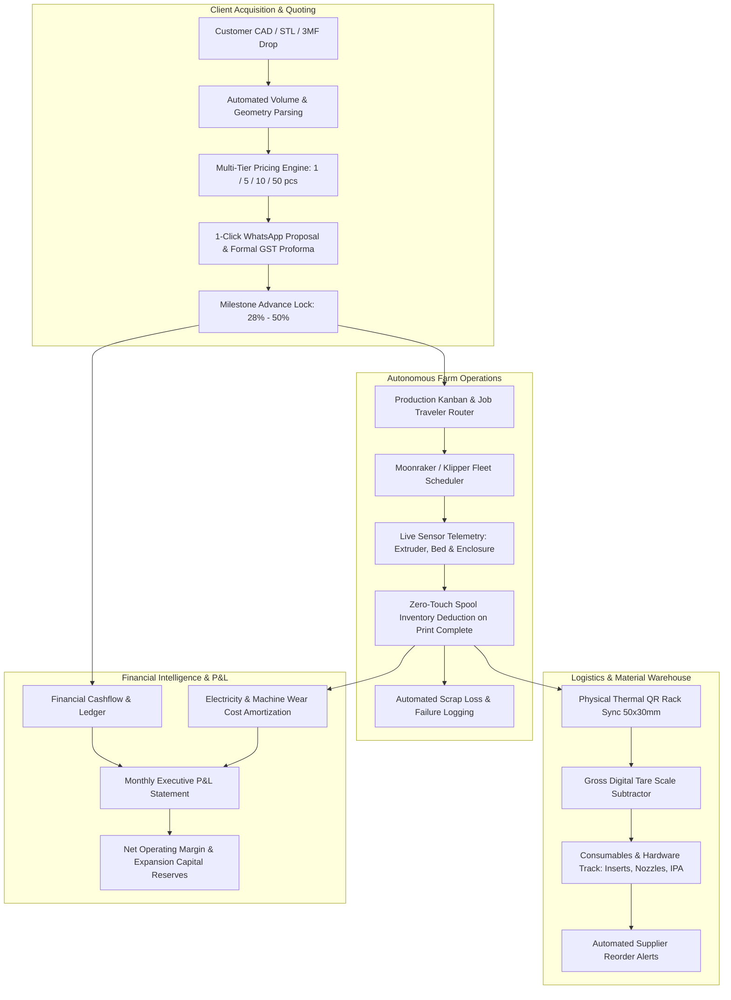

# 🗺️ Made N More & 3D Printing Labs — Master Strategic Roadmap & Industrial OS Blueprint
### The Next-Generation Manufacturing Executive System (MES) & Farm Scaling Engine
**Document Version:** 5.0 (Industrial Enterprise & Operator Command Center)  
**Target Operator:** Business Owner, Farm Manager & Production Technicians  
**Core Purpose:** Automate all administrative, quoting, hardware telemetry, material tracking, and financial overhead so the owner can scale from 4 machines to 20+ machines with zero added managerial friction.

---

## 🎯 Executive Vision: The Operator's Unfair Advantage

Made N More / 3D Printing Labs is positioned as Pune's premier B2B digital manufacturing and rapid prototyping service. Our competitive moat is **velocity, precision, and zero administrative waste**.



---

## 🗓️ Master Phased Roadmap: From Workshop to Industrial Digital Factory

```text
┌────────────────────────────────────────────────────────────────────────────────────────┐
│ PHASE 1 (Delivered): Production Kanban Pipeline & Milestone Billing                   │
│ • Multi-item part assemblies under one order                                           │
│ • 8-Stage visual Kanban board with drag & drop                                         │
│ • GST Tax Invoicing (SAC 9988 / HSN 3916) with A4 PDF print view                       │
│ • Milestone installment receipt vouchers (28% deposit, 22% proof, 50% final)           │
└────────────────────────────────────────────────────────────────────────────────────────┘
                                    │
                                    ▼
┌────────────────────────────────────────────────────────────────────────────────────────┐
│ PHASE 2 (Delivered): Multiple 3D Printer Farm, LAN Fleet Hub & Timelapse Archiver     │
│ • Snapmaker U1 Direct LAN Moonraker Bridge (live nozzle/bed telemetry, port 80)        │
│ • Server-Side Proxy Fallback: Zero CORS restrictions across LAN/Wi-Fi devices          │
│ • Real-time status cards (Snapmaker U1, Voron CoreXY, Bambu Lab P1S, Ender Plus)       │
│ • Live Chamber/Bed/Nozzle thermal telemetry with target vs actual gauges               │
│ • Timelapse Video Streamer & Bulk Downloader: 1-Click sequential download of all .mp4s │
│ • Fleet status filter pills (All Machines, 🟢 Printing, 🟡 Idle/Ready, 🔴 Maintenance) │
│ • Operating hours odometer & preventative maintenance alerts (nozzles, rails, belts)   │
└────────────────────────────────────────────────────────────────────────────────────────┘
                                    │
                                    ▼
┌────────────────────────────────────────────────────────────────────────────────────────┐
│ PHASE 3 (Delivered): Operator Support Tools, Slicer Ingestion & QC Job Travelers      │
│ • In-Browser G-Code, 3MF & STL parser: Drag & drop sliced files to auto-read mass/time │
│ • 1-Click WhatsApp Milestone Quote Generator with deposit & QC dispatch terms          │
│ • Printable Workshop Job Traveler Card (📋): A4 QC checklist & router for shop floor   │
│ • Zero-Touch Spool Deduction: Auto-decrements grams on print complete                  │
│ • Scrap Loss & Failed Print Logger: Deducts wasted filament and logs ledger loss       │
│ • Digital Scale Tare Tool: Exact usable filament calculation subtracting spool tare    │
└────────────────────────────────────────────────────────────────────────────────────────┘
                                    │
                                    ▼
┌────────────────────────────────────────────────────────────────────────────────────────┐
│ PHASE 4 (Active Upgrade): Warehouse Materials Barcode/QR Management & Consumables      │
│ • Thermal QR Label Generation (50x30mm) for spool storage racks and bin organization   │
│ • Workshop hardware tracking: Brass heat-set inserts (M2–M5), high-flow nozzles, IPA   │
│ • Live inventory valuation (Total raw material worth in INR on dashboard)              │
│ • Automated low-spool threshold replenishment notifications (< 200g buffer)            │
│ • Multi-spool batch weight auditor using gross digital scale tare calculation          │
└────────────────────────────────────────────────────────────────────────────────────────┘
                                    │
                                    ▼
┌────────────────────────────────────────────────────────────────────────────────────────┐
│ PHASE 5 (Next Priority): Deep Financial Intelligence & Cost Accounting Engine          │
│ • Granular Job Costing Breakdown: Material + Electricity + Machine Wear + Labor Buffer │
│ • Multi-Tier Volume Discount Matrix (1, 5, 10, 25, 50 pcs with price-per-part curves) │
│ • Monthly automated Profit & Loss statements (Gross Sales vs Material vs Power vs Net) │
│ • Machine depreciation & wear reserves allocation (amortizing ₹55,000 capital asset)   │
│ • Material consumption forecasting (reorder alerts before peak production runs dry)    │
└────────────────────────────────────────────────────────────────────────────────────────┘
                                    │
                                    ▼
┌────────────────────────────────────────────────────────────────────────────────────────┐
│ PHASE 6: Automated Quotation Engine, Geometry DFM Analyzer & Slicing AI                │
│ • Direct STL Geometry analysis (bounding box, surface area, volume, mass estimate)     │
│ • Design For Manufacturability (DFM) warnings: minimum wall thickness, overhang angles │
│ • Material Recommendation Engine (e.g. recommending PETG-HS over PLA for outdoors)    │
│ • 1-Click Formal Commercial PDF Proforma Quotation with custom B2B terms               │
└────────────────────────────────────────────────────────────────────────────────────────┘
                                    │
                                    ▼
┌────────────────────────────────────────────────────────────────────────────────────────┐
│ PHASE 7: Autonomous Farm Scheduler, Auto-Preheat Dispatcher & Klipper Queue Daemon     │
│ • Centralized Print Queue Dispatcher: Automatically routes queued jobs to idle printer │
│ • Auto-Preheat on Job Assignment: Wakes up bed/nozzle heaters 5 minutes prior to print │
│ • Print Bed Ejection / Conveyor support for continuous unattended batch production     │
│ • Multi-printer power load balancer (prevents tripping workshop breaker during heatup) │
└────────────────────────────────────────────────────────────────────────────────────────┘
                                    │
                                    ▼
┌────────────────────────────────────────────────────────────────────────────────────────┐
│ PHASE 8 (Enterprise Scaling): B2B Client Portal & Secure File Vault                    │
│ • Private white-labeled client link: Clients can upload CAD files under mutual NDA     │
│ • Live stage tracker without revealing internal machine IPs or farm secrets            │
│ • Instant re-order button for previously verified production batches                   │
│ • Automated delivery note & courier tracking integration (Shiprocket / Bluedart)       │
└────────────────────────────────────────────────────────────────────────────────────────┘
```

---

## 💰 Commercial Pricing Architecture & Unit Economics Formula

To maintain a **60% to 75% gross profit margin** while remaining extremely competitive against industrial injection molders and local bureaus, all jobs are priced using our standardized cost equation:

$$\text{Final Part Quote} = \left[ (\text{Mass} \times C_{\text{mat}}) + (\text{Time} \times C_{\text{elec}}) + (\text{Time} \times C_{\text{wear}}) + C_{\text{prep}} \right] \times M_{\text{margin}} \times D_{\text{volume}}$$

### Where:
1. **$C_{\text{mat}}$ (Raw Filament Cost per Gram)**:
   - PLA+ (Numakers): $\approx ₹0.90 / \text{g}$
   - PETG-HS (High Speed): $\approx ₹1.10 / \text{g}$
   - ABS Engineering: $\approx ₹1.20 / \text{g}$
   - TPU+ Flexible: $\approx ₹1.60 / \text{g}$
   - PLA Silk / Dual: $\approx ₹1.30 / \text{g}$
   - PLA Matte: $\approx ₹1.10 / \text{g}$
2. **$C_{\text{elec}}$ (Electricity Cost per Hour)**:
   - Average 350W printer draw at Pune MSEDCL commercial tariff ($₹8.50 / \text{kWh}$):
   - $0.35\text{ kW} \times ₹8.50 = ₹2.98 \approx ₹3.00 / \text{hr}$
3. **$C_{\text{wear}}$ (Machine Wear & Depreciation Reserve)**:
   - Amortizing a ₹55,000 printer over 3,000 operational hours + maintenance:
   - $₹55,000 / 3,000\text{h} \approx ₹18.33 / \text{hr}$
4. **$C_{\text{prep}}$ (Slicing, Machine Setup & Post-Processing Buffer)**:
   - Flat ₹50 to ₹100 per production plate setup.
5. **$M_{\text{margin}}$ (Owner Margin Multiplier)**:
   - Standard Commercial: $2.5\times$ to $3.0\times$ (equivalent to 150%–200% markup).
   - High-Speed / Overnight Emergency: $3.5\times$ to $4.0\times$.
6. **$D_{\text{volume}}$ (Batch Volume Tier Discount Curve)**:
   - $1\text{ to }4\text{ units}$: $1.00$ ($0\%$ discount)
   - $5\text{ to }9\text{ units}$: $0.90$ ($10\%$ discount)
   - $10\text{ to }24\text{ units}$: $0.85$ ($15\%$ discount)
   - $25\text{ to }49\text{ units}$: $0.80$ ($20\%$ discount)
   - $50+\text{ units}$: $0.75$ ($25\%$ volume production discount)

---

## 🖨️ Hardware Fleet Scale-Up Roadmap

| Stage | Fleet Composition | Capacity | Primary Capability | Target Monthly Revenue |
| :--- | :--- | :--- | :--- | :--- |
| **Current (Stage 1)** | 1x Snapmaker U1 Dual, 1x Voron 2.4, 1x Bambu P1S, 1x Ender 3 | 4 Machines | Multicolor PLA/PETG/ABS, Rapid Prototypes | ₹50,000 – ₹1,20,000 |
| **Stage 2 (Expansion)** | +2x Bambu Lab X1-Carbon AMS, +1x Voron 350mm | 7 Machines | High-temperature ABS/Nylon-CF, Carbon fiber robotics | ₹1,50,000 – ₹3,00,000 |
| **Stage 3 (Pilot Factory)** | +1x Industrial Formlabs Form 4 SLA, +1x Conveyor Continuous Bed | 10 Machines | High-detail resin, continuous pilot runs (500+ pcs) | ₹4,00,000 – ₹7,50,000 |
| **Stage 4 (Digital Hub)** | 15+ CoreXY Farm + In-House SLS Nylon Polymer | 15+ Machines | True production manufacturing replacing small injection molds | ₹10,00,000+ |

---

## 🛡️ Technical Architecture & HomeLab Server Integrity

- **Frontend Core**: Vanilla ES6+, CSS3 Glassmorphism tokens, reactive in-memory client store with optimistic UI updates.
- **Backend API Server**: Node.js + Express 5 running on `0.0.0.0:4000`, persisting JSON ACID state to `src/data/persisted.json`.
- **Physical Hardware Connectors**:
  - Moonraker JSON-RPC & HTTP REST bridge with automatic server-side proxy fallback to bypass cross-origin browser sandbox restrictions.
  - Subnet autodiscovery scanner for DHCP IP shifts.
  - Blob stream downloader for cross-origin MP4 timelapse captures.
- **Data Safety**:
  - 1-Click JSON full database export & CSV backups.
  - Docker containerization (`Dockerfile` + `docker-compose.yml`) with volume mount preservation.
  - PM2 process daemon ecosystem (`ecosystem.config.cjs`) with auto-restart on memory spikes.

---

*Document Author: Business Architecture Team, Made N More & 3D Printing Labs*  
*Base Operations: Pune Industrial Corridor, Maharashtra, India*
