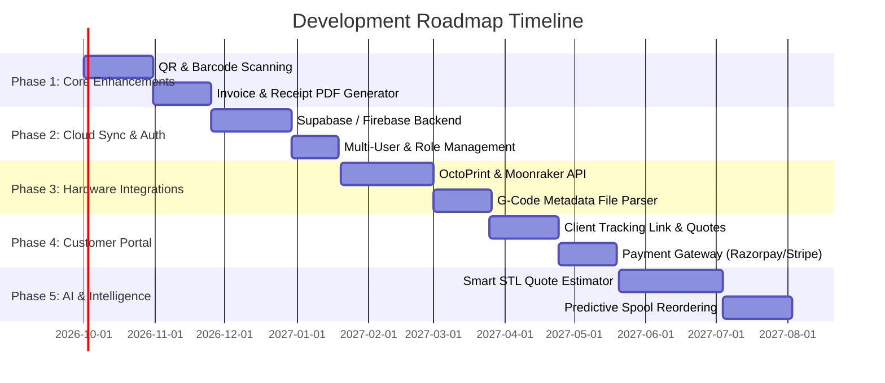

# 🗺️ Made N More — Product Roadmap & Future Plan

This document outlines the strategic roadmap, architectural evolution, and feature milestones planned for the **Made N More** 3D Printing Business Management Platform.

---

## 🎯 Strategic Goals & Vision

Transform **Made N More** from a local inventory and ledger tracker into an enterprise-grade, end-to-end Operating System for 3D printing farms, maker studios, and on-demand fabrication services.

---

## 🗓️ Phase-by-Phase Roadmap

---

## 📌 Phase 1: Core Operational Enhancements (Near-Term)

### 🏷️ 1. Physical Spool QR & Barcode Tagging
- **Label Generation**: Generate printable labels with unique QR codes for every physical spool in inventory.
- **Mobile / Webcam Scanner**: Scan spool QR codes to immediately pull up spool stats, log weight changes, or flag usability status directly from a smartphone or desktop camera.
- **Spool Net Weight Tracking**: Log tare weight vs. gross weight to calculate exact remaining filament in grams rather than broad spool counts.

### 📄 2. Client Invoicing & PDF Generation
- **One-Click Invoices**: Generate branded PDF invoices for client orders showing itemized line items, GST/tax calculations, and logged milestone payments.
- **Payment Receipts**: Generate downloadable receipts for each milestone installment (e.g. 28% advance receipt, final completion receipt).
- **Custom Studio Branding**: Upload custom logo, business GSTIN, address, and bank transfer / UPI QR details into invoice templates.

### 🔔 3. Intelligent Stock Alerts
- Customizable low-filament thresholds (e.g. alert when PLA+ Black drops below 500g or 1 spool).
- Visual warning banner on Dashboard for materials marked unusable or nearing depletion.

---

## ☁️ Phase 2: Cloud Sync, Multi-Device & Collaboration

### 🌐 1. Backend Migration (Firebase / Supabase)
- **Real-Time Database**: Transition from browser `localStorage` to a cloud-synced backend (Supabase PostgreSQL / Firebase Firestore).
- **Cross-Device Access**: Seamless synchronization between workstation PC, workshop tablets, and mobile phones.
- **Offline-First Support**: PWA (Progressive Web App) caching with automatic background synchronization when internet reconnects.

### 👥 2. Role-Based Access Control (RBAC)
- **Roles**: Admin / Owner, Workshop Technician, Accountant / Sales.
- **Permissions**:
  - *Technicians*: Can adjust spool weights, update print progress, view print queue.
  - *Accountants*: Access financial ledger and invoices without editing machine configurations.
  - *Admin*: Unrestricted master access.

---

## ⚙️ Phase 3: Hardware & 3D Printer Integrations

### 🔌 1. 3D Printer Fleet Monitoring (OctoPrint / Moonraker / Bambu Lab API)
- Connect directly to printer APIs (Klipper Moonraker, OctoPrint, Bambu Lab MQTT/Cloud).
- Real-time printer status dashboard: nozzle temperatures, bed temperatures, active job completion %, and remaining time.
- Webcam stream embed for live print verification.

### 📉 2. Automated Inventory Deduction
- Read sliced G-code / 3MF metadata (filament length and weight consumed).
- When a print completes successfully, automatically deduct the corresponding grams from the assigned spool in inventory.
- Failure logging: One-click "Print Failed" button to log wasted filament to scrap metrics and transaction ledger.

---

## 🛍️ Phase 4: Client Portal & Automated Quoting

### 🔗 1. Self-Service Client Tracking Portal
- Provide clients with a secure tracking link (`madenmore.com/track/{order_id}`) to view their project milestone progress (e.g. 28% deposit verified ➔ Modeling ➔ 3D Printing ➔ Post-processing ➔ Ready for Dispatch).
- Direct approval of 3D print digital proofs and photo updates.

### 💳 2. Payment Gateway Integration
- Integrate payment links via **Razorpay, Stripe, or UPI QR**.
- Automatically log payments to the Orders and Transactions tables upon successful webhook callbacks.

### 💬 3. WhatsApp & Email Notification Webhooks
- Automated transactional updates sent to clients:
  - *"Your print job has started!"*
  - *"Milestone payment of ₹2,000 received (28%). Remaining balance: ₹4,750."*
  - *"Your 3D print is completed and ready for pickup/shipping!"*

---

## 🧠 Phase 5: Machine Learning & Predictive Intelligence

### 📐 1. Automated 3D File (STL / OBJ / 3MF) Instant Quoting
- Allow clients or operators to drag-and-drop 3D models into the browser.
- WebAssembly/Three.js 3D mesh volume and bounding box calculation.
- Instant estimation of print time, support requirements, material mass, and cost breakdown.

### 📈 2. Predictive Filament Purchasing & Farm Analytics
- Machine learning forecasting on monthly material consumption based on seasonal historical trends.
- Vendor price tracking to highlight best reorder times and preferred suppliers.
- Machine failure rate analysis by material brand and color.

---

## 📈 Success Metrics & KPIs

| Metric Area | Target Milestone |
| :--- | :--- |
| **Spool Tracking Accuracy** | 98%+ inventory correlation with physical stock |
| **Milestone Collection** | 0 lost or forgotten installment payments |
| **Quoting Speed** | Generate client quote in < 60 seconds with Calculator |
| **Fleet Downtime** | Reduced by 25% via predictive maintenance tracking |

---

*Document Managed by Made N More Development Team.*  
*Review Schedule: Quarterly.*
