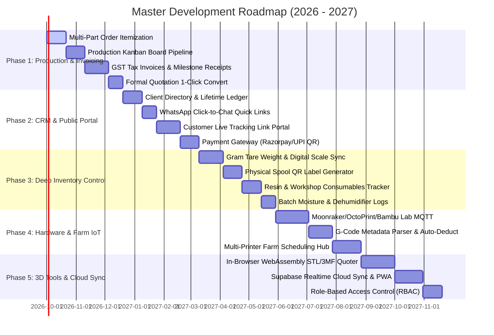
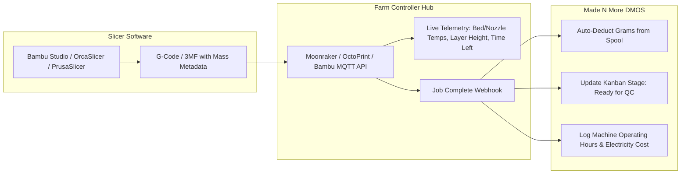
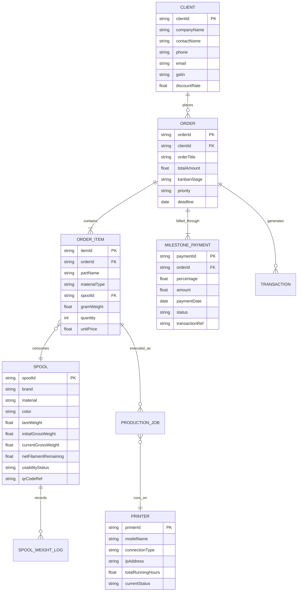

# 🗺️ Made N More & 3D Printing Labs — Master Product Roadmap & Future Architecture
### End-to-End Operating System for 3D Printing Businesses, Maker Farms & Rapid Prototyping Studios
**Document Version:** 2.0 (Deep Technical Specification)  
**Status:** Living Engineering Document  
**Maintained by:** Made N More Core Development Team  

---

## 📑 Executive Overview & Vision

**Made N More** is evolving from an internal offline management tool into an all-in-one **Digital Manufacturing Operating System (DMOS)**. It bridges the gap between customer relationship management (CRM), precision job quoting, milestone installment billing, factory floor print farm scheduling, gram-accurate material accounting, and automated machine hardware interfaces.

```mermaid
graph TB
    subgraph Client Layer
        A1[Client Portal / Shareable Tracking Link]
        A2[WhatsApp & Email Auto-Notifications]
        A3[Instant STL / 3MF Drag & Drop Web Quoter]
    end

    subgraph Business Management Layer (Made N More Core)
        B1[CRM & Client Profile Ledger]
        B2[Percentage Milestone Billing Engine]
        B3[GST Invoicing & Digital Receipts Generator]
        B4[Interactive Production Kanban Board]
        B5[Financial P&L & Scrap Loss Analytics]
    end

    subgraph Workshop & Inventory Layer
        C1[Gram-Level Tare & Net Weight Spool Matrix]
        C2[Physical QR / Barcode Spool Scanner]
        C3[Resin & Workshop Consumables Registry]
        C4[Batch Lot & Moisture Dehumidification Timers]
    end

    subgraph Hardware & IoT Automation Layer
        D1[OctoPrint / Moonraker / Bambu Lab API]
        D2[G-Code & 3MF Slicer Metadata Parser]
        D3[Auto-Spool Gram Deduction upon Print Complete]
        D4[Computer Vision First-Layer Failure Detection]
    end

    A1 <--> B2
    A3 --> B1
    B4 <--> D1
    D2 --> C1
    D3 --> C1
    B2 <--> B3
    B5 <--> B2
```

---

## 🗓️ Strategic Phased Roadmap (Gantt Overview)



---

## 📌 Detailed Phase Specifications

---

### 🧩 PHASE 1: Advanced Production Workflow & Commercial Billing

Transform the current orders and calculator modules into an industrial-grade production pipeline with itemized assemblies, visual Kanban stages, and compliant invoicing.

#### 1.1 Multi-Item Order Itemization & Assembly Breakdown
- **Problem Solved**: Real-world prototyping orders rarely consist of a single part; clients order multi-part assemblies (e.g. *5x Drone Arms in PETG-HS, 2x Camera Mounts in TPU, 1x Top Plate in ABS*). Currently, orders have a single text description.
- **Data Model Specification**:
  ```javascript
  // Order Item Schema
  {
    itemId: "item_xyz123",
    partName: "Front Motor Mount",
    cadFileRef: "mount_v4.step",
    quantity: 4,
    materialType: "PETG-HS",
    colorName: "Pitch Black",
    infillPercentage: 40,
    estimatedPrintTimeMinutes: 145,
    gramWeightPerUnit: 68,
    unitPrice: 420.00,
    subtotal: 1680.00,
    itemStatus: "printing" // "queued" | "printing" | "completed" | "failed" | "delivered"
  }
  ```
- **UI Enhancements**:
  - Embedded item table inside the New Order modal with "+ Add Another Part" row.
  - Per-item progress checkmarks allowing partial order fulfillment and split deliveries.

#### 1.2 Interactive Production Kanban Board
- **Visual Workflow Columns**:
  1. `Draft / RFQ`: Inbound enquiry undergoing file printability check.
  2. `Advance Paid (Locked)`: Initial milestone received; spools and machine reserved.
  3. `Slicing & Pre-Flight`: G-code generated, support structure verified, plate assigned.
  4. `In Print Queue`: Waiting for an open machine build plate.
  5. `Printing`: Actively running on printer fleet.
  6. `Post-Processing & QA`: Support removal, deburring, heat-set brass insert pressing, dimensional caliper check.
  7. `Ready for Dispatch`: Packed with protective foam, final photo proof generated.
  8. `Settled & Delivered`: Final milestone payment collected and goods handed over.
- **Drag-and-Drop UX**: Native HTML5 Drag and Drop API with smooth micro-animations.
- **Priority Tags**: Badges for `Standard (3-5 days)`, `Express (48 hrs)`, and `Emergency Overnight (24 hrs)`.

#### 1.3 GST Invoicing & Milestone Installment Receipts (PDF Engine)
- **Indian GST Compliance**:
  - Automatic HSN/SAC Code Insertion:
    - **SAC 9988**: Custom digital fabrication & 3D manufacturing job-work services.
    - **HSN 3916**: Monofilament, polymers & raw 3D printing spools.
    - **HSN 8477**: 3D printer hardware components and tooling fixtures.
  - Automatic CGST (9%) + SGST (9%) for intra-state Maharashtra, or IGST (18%) for inter-state clients.
- **Client-Side PDF Generation**:
  - Built using lightweight, zero-dependency PDF rendering (`jspdf` or HTML canvas print-to-PDF).
  - Studio header with company GSTIN, PAN, bank account details, and dynamic UPI QR code (`upi://pay?pa=...&am=amount`).
- **Granular Milestone Receipts**:
  - Downloadable single-page receipt for individual installment payments (e.g. *Receipt #REC-104-1 for ₹2,000 — 28% Advance Deposit*).

#### 1.4 Formal Quotation Generator with 1-Click Conversion
- Draft official quotes with validity periods (e.g. *Valid for 7 days*).
- Terms and conditions auto-injection: Customer file ownership warranties, dimensional tolerance disclaimers (±0.2mm standard FDM), and chargeable reprint terms for client file revisions.
- Single-click **"Convert to Production Order"** button that automatically copies all specs, applies the selected milestone split, and routes to the Kanban pipeline.

---

### 👥 PHASE 2: Client CRM, Communication & Public Self-Service Portal

Eliminate endless status phone calls and manual messaging by automating client interactions and self-service status tracking.

#### 2.1 Centralized Client CRM & Account Directory
- **Client Profile Records**:
  - Company / Studio Name (e.g. *Product Designer Studios*, *RoboTech Automation Labs*).
  - Primary Contact Person, Phone, Email, Delivery Address, Billing GSTIN.
  - Client Classification: `Hardware Startup`, `Industrial MIDC`, `R&D Lab`, `Student Maker`, `Agile Manufacturer`.
- **Financial Account Ledger**:
  - Lifetime Revenue Contributed.
  - Active Orders Count & Cumulative Unsettled Balance Due.
  - Preferred Filament Colors & Materials.
- **Tiered Commercial Discounting**:
  - Assign automated client discounts (e.g. *15% partner discount on machine-hour rates for verified repeat industrial clients*).

#### 2.2 Instant WhatsApp Click-to-Chat Deep Links
- Pre-composed direct WhatsApp Web messaging using `https://wa.me/{phone}?text=...` formatted with encoded markdown:
  - **Deposit Confirmation**:
    > *"Hi [Name], we have received your advance payment of ₹[Amount] ([Percent]%) for Order #[ID]. Your CAD files have cleared DFM review and are queued for printing on our Snapmaker U1 farm."*
  - **Production Milestone**:
    > *"Update on Order #[ID]: Part 1 (ABS Enclosure) is successfully printed and in post-processing. Photos attached! Current project progress: [Progress]%."*
  - **Dispatch & Final Balance Notice**:
    > *"Your 3D prints are finished, quality checked, and boxed! Remaining balance due: ₹[Balance]. Kindly settle via the UPI QR link to initiate immediate dispatch."*

#### 2.3 Public Self-Service Order Tracking Portal (`/#/track?order=ID`)
- **Zero-Login Client Experience**: A lightweight, mobile-responsive client-facing page accessible via a unique UUID or Order ID.
- **Live Visual Stepper**:
  - Step 1: CAD Approval ✅
  - Step 2: Milestone Advance Paid (28%) ✅
  - Step 3: Manufacturing in Progress (60%) 🔄
  - Step 4: Quality Inspection Passed ⏳
  - Step 5: Dispatched / Out for Delivery ⏳
- **High-Resolution Photo Gallery**: Operator uploads 2–3 photos of the completed parts on the build plate or measuring bench for instant client visual sign-off.
- **Integrated Milestone Payment Trigger**: Embedded "Pay Remaining Balance (₹[Balance])" button with dynamic UPI QR code generator.

---

### 🧵 PHASE 3: Deep Gram-Level Inventory Control & Workshop Consumables

Shift inventory management from rough spool counts to precise gram-accurate material tracking, barcode identification, and workshop consumable logs.

#### 3.1 Gram-Level Tare & Net Weight Calculation
- **Empty Spool Core Tare Library**:
  | Spool Brand | Core Material | Standard Empty Tare Weight |
  | :--- | :--- | :--- |
  | **Numakers** | Plastic Core | 210 g |
  | **eSun** | Cardboard Core | 230 g |
  | **Bambu Lab** | Reusable Plastic Spool | 250 g |
  | **Wol3D** | High-Density Plastic | 240 g |
  | **Generic / OEM** | Cardboard / Plastic | Configurable (Default 220 g) |
- **Smart Digital Scale Input**:
  - Enter total gross weight directly from workshop digital scale (e.g. Gross: *860 g*).
  - System automatically subtracts tare: $\text{Net Filament} = 860\text{g} - 210\text{g} = 650\text{g}$ remaining.
  - Warns if net filament remaining is insufficient for the next queued job in the production list.

#### 3.2 Spool QR Code & Barcode Label Generation
- Generate printable labels (standard 50mm x 30mm thermal sticker size) for every new spool entering the shop:
  - Spool ID & Brand
  - Material (e.g. *PETG-HS Pitch Black*)
  - Purchase Date & Cost/kg
  - Unique QR Code encoding `spool://{spool_id}`
- **Webcam / Smartphone QR Scanner**:
  - Scanning the physical spool opens its digital modal instantly to record weight deductions or mark usability.

#### 3.3 Hygroscopic Filament Moisture & Drying Tracker
- Filament materials like **PETG, ABS, TPU, and Nylon** absorb ambient atmospheric moisture, causing steam bubbles, stringing, and weak layer adhesion during printing.
- **Features**:
  - "Bake / Dry Spool" action button with countdown timer (e.g. *ABS: 6 hours @ 65°C*).
  - Last-dried timestamp tag with visual amber alerts when a hygroscopic spool has been exposed to ambient workshop humidity for >7 days.

#### 3.4 SLA/MSLA Resin & Workshop Consumables Registry
- Expand beyond FDM spools to full workshop materials:
  - **Photopolymer Resins**: Tracked by volume (ml), color, manufacturer, and calibrated layer exposure times (sec).
  - **Workshop Consumables**:
    - Isopropyl Alcohol (IPA 99%) tracked in Liters.
    - FEP / PFA vat release films.
    - Nozzles (0.4mm Brass, 0.4mm Hardened Steel for abrasive filaments, 0.6mm High-Flow).
    - PEI spring steel build plates & textured sheets.
    - Brass threaded heat-set inserts (M2, M3, M4, M5 packs).

---

### ⚙️ PHASE 4: Hardware Automation, IoT Farm Hub & Slicer Integration

Connect the software directly to physical 3D printers for automated logging, real-time telemetry, and zero-touch inventory deduction.



#### 4.1 3D Printer Fleet Telemetry Hub
- **Direct API Connectors**:
  - **Moonraker (Klipper)**: REST API & WebSockets for high-speed custom CoreXY printers.
  - **OctoPrint**: REST API for legacy modified bedslingers.
  - **Bambu Lab Fleet**: Local MQTT broker connection for high-speed P1/X1/A1 series.
  - **Snapmaker U1**: Local serial / WiFi interface monitoring.
- **Fleet Overview Dashboard View**:
  - Real-time nozzle and heatbed temperature graphs.
  - Active file name, current layer / total layers, and percentage completion ring.
  - Live webcam snapshot stream embedded directly into the workshop view.

#### 4.2 Automated Slicer Metadata Extraction & Spool Deduction
- When a `.gcode` or `.3mf` file is sliced, slicers append detailed metadata comments in the file header:
  ```text
  ; filament used [g] = 142.85
  ; filament used [cm3] = 114.28
  ; filament cost = 135.70
  ; total estimated time = 3h 24m 12s
  ```
- **Zero-Touch Flow**:
  1. The user drops the sliced file into the print queue.
  2. The system automatically reads the exact grams required (142.85g).
  3. Upon the printer signaling `PRINT_DONE` via Moonraker/OctoPrint webhook, 142.85g is automatically decremented from the assigned spool in the database.
  4. If the print failed (`PRINT_CANCELLED`), an operator popup asks: *"How many grams were printed before failure?"* to log scrap loss accurately.

---

### 🧠 PHASE 5: Client-Side 3D Mesh Quoter, Cloud Sync & Team Permissions

Modernize the technology foundation with in-browser 3D file geometry analysis, cloud data synchronization, and role-based permissions.

#### 5.1 In-Browser 3D File (STL / 3MF / OBJ) Volume & Pricing Engine
- **WebAssembly / Three.js Mesh Analyzer**:
  - Drag-and-drop 3D models directly into the web browser with zero server uploads required.
  - Compute accurate 3D bounding box dimensions ($X \times Y \times Z$ in millimeters).
  - Calculate exact watertight mesh volume in cubic centimeters ($\text{cm}^3$) using the Gauss Divergence Theorem:
    $$V = \frac{1}{6} \sum_{i=1}^{N} \mathbf{v}_1 \cdot (\mathbf{v}_2 \times \mathbf{v}_3)$$
- **Instant Weight & Cost Projection**:
  - User selects material (e.g. *PETG-HS, density = 1.25 g/cm³*) and target infill percentage (e.g. *20% Gyroid*).
  - Formula: $\text{Mass} = [V_{\text{shell}} + (V_{\text{core}} \times \text{Infill}\%)] \times \text{Density}$.
  - Instantly populates the cost calculator with material cost, recommended print time estimate, and suggested quote price in under 3 seconds.

#### 5.2 Real-Time Cloud Synchronization (Supabase / Firebase Migration)
- Transition from local browser `localStorage` to **Supabase (PostgreSQL + PostgREST + Realtime)**.
- **Architectural Benefits**:
  - Multi-device sync: Workshop PC, tablet mounted next to 3D printers, and manager smartphone all reflect changes simultaneously.
  - Row-Level Security (RLS) ensuring enterprise-grade data isolation.
  - Progressive Web App (PWA) with Service Worker caching for complete offline operation in case of workshop internet downtime.

#### 5.3 Role-Based Access Control (RBAC) Matrix

| Feature / Screen | Admin / Owner | Workshop Technician | Accountant / Sales |
| :--- | :---: | :---: | :---: |
| **Inventory Spool Weight Adjustment** | ✅ Full Access | ✅ Edit Weights / Scan QR | ❌ Read-Only |
| **Orders & Kanban Production Board** | ✅ Full Access | ✅ Update Stage / Upload QC Photos | ✅ View Only |
| **Pricing Calculator Margin Settings** | ✅ Full Access | ❌ Hidden | ❌ Hidden |
| **Financial Ledger & Profit Margins** | ✅ Full Access | ❌ Hidden | ✅ Full Ledger Access |
| **GST Tax Invoices & Milestone Receipts**| ✅ Full Access | ❌ Hidden | ✅ Create & Export PDFs |
| **Hardware Fleet Monitoring & Queuing** | ✅ Full Access | ✅ Full Access | ❌ Hidden |

---

## 📊 Complete Data Architecture & ER Diagram



---

## 📈 Key Performance Indicators (KPIs) & Target Benchmarks

| Domain | Key Metric | Target Goal | Tracking Mechanism |
| :--- | :--- | :---: | :--- |
| **Material Accuracy** | Spool Physical vs Digital Discrepancy | $< 2.0\%$ variance | Weekly Tare Scale Audit |
| **Financial Health** | Uncollected Milestone Payments $>7$ Days | $0$ bad debts | Automated WhatsApp Alerts |
| **Quoting Velocity**| Inbound 3D Model to Formal Quote Time | $< 5$ minutes | In-Browser 3D Mesh Analyzer |
| **Farm Uptime** | Planned Fleet Running Utilization | $> 65\%$ uptime | Moonraker / OctoPrint Fleet Hub |
| **Scrap Rate** | Failed Print Material Loss vs Total Used | $< 4.5\%$ mass | Scrap Loss Ledger & Root Cause Tag |

---

*This document serves as the master engineering and operational blueprint for Made N More and 3D Printing Labs.*  
*Maintained by: Made N More Software & Operations Team.*
