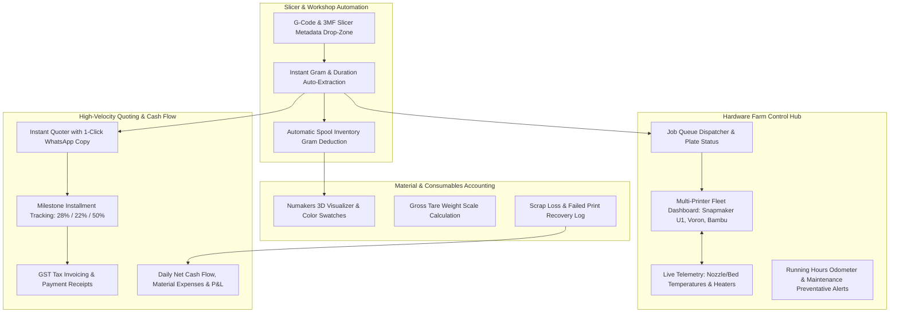

# 🗺️ Made N More & 3D Printing Labs — Master Operator Roadmap & Business System
### The Maker-CEO Operating System: 100% Focused on Streamlining Internal Workshop Management, Profitability & Machine Fleets
**Document Version:** 4.0 (Owner & Operator Command Center)  
**Target User:** Business Owner & Workshop Technicians  
**Primary Goal:** Automate daily administrative friction, quoting, fleet monitoring, material tracking, and job accounting so the owner can focus on making and scaling.  

---

## 🎯 Strategic Direction: Built For YOU, The Business Owner

> **Zero Client-Facing Bloat**: The customer will **NOT** be seeing or using this software. All customer-facing portals, public tracking links, and external web slicers are deferred to a distant, late-stage horizon. 
> 
> **Every single screen, calculation, and button is built as an internal support tool for YOU to run, manage, quote, and scale the business effortlessly.**



---

## 🗓️ Master Phased Roadmap: The Operator's Support System

```text
┌────────────────────────────────────────────────────────────────────────────────────────┐
│ PHASE 1 (Delivered): Production Kanban Pipeline & Milestone Billing                   │
│ • Multi-item part assemblies under one order                                           │
│ • 8-Stage visual Kanban board with drag & drop                                         │
│ • GST Tax Invoicing (SAC 9988 / HSN 3916) with A4 PDF print view                       │
│ • Individual milestone installment receipt vouchers (28% deposit, 22% proof, 50% final)│
└────────────────────────────────────────────────────────────────────────────────────────┘
                                    │
                                    ▼
┌────────────────────────────────────────────────────────────────────────────────────────┐
│ PHASE 2 (Delivered & Expanding): Multiple 3D Printer Farm & Fleet Telemetry           │
│ • Real-time status cards (Snapmaker U1, Voron CoreXY, Bambu Lab P1S, Ender Plus)       │
│ • Extruder & bed thermal telemetry (Actual vs Target temperatures)                     │
│ • 1-Click job dispatching from active orders queue                                     │
│ • Operating hours odometer & preventative maintenance alerts (nozzles, rails, belts)   │
└────────────────────────────────────────────────────────────────────────────────────────┘
                                    │
                                    ▼
┌────────────────────────────────────────────────────────────────────────────────────────┐
│ PHASE 3 (Current Build): Owner Support Tools & Slicer File Ingestion                  │
│ • In-Browser G-Code & 3MF parser: Drag & drop sliced files to auto-read grams & hours  │
│ • 1-Click WhatsApp Quote Generator: Pre-formatted WhatsApp messages for clients       │
│ • Quick Stock Adjustment steppers on Numakers spools                                   │
│ • Scrap Loss & Failed Print Logger: Log spaghetti/failures and reclaim costs           │
└────────────────────────────────────────────────────────────────────────────────────────┘
                                    │
                                    ▼
┌────────────────────────────────────────────────────────────────────────────────────────┐
│ PHASE 4: Deep Material Accounting & Digital Scale Sync                                │
│ • Tare weight database (Numakers 210g, eSun 230g, Bambu 250g)                          │
│ • Digital scale tare subtraction (Gross input -> Net usable filament calculation)      │
│ • Physical thermal QR label printing (50x30mm) for spool racks                         │
│ • Workshop consumables: Resins (ml), nozzles, IPA, and heat-set brass threaded inserts │
└────────────────────────────────────────────────────────────────────────────────────────┘
                                    │
                                    ▼
┌────────────────────────────────────────────────────────────────────────────────────────┐
│ PHASE 5: Internal Financial Intelligence & Workshop P&L                                │
│ • Monthly Profit & Loss statements (Gross Revenue vs Raw Filament vs Electricity)     │
│ • Machine depreciation & wear reserves allocation                                      │
│ • Material consumption forecasting (which colors to reorder before running dry)        │
└────────────────────────────────────────────────────────────────────────────────────────┘
                                    │
                                    ▼
┌────────────────────────────────────────────────────────────────────────────────────────┐
│ PHASE 6 (Distant Scaled Horizon): Client Self-Service Portals                          │
│ • Public tracking links (Deferred until printer farm exceeds 10 machines)              │
│ • Web-to-print automated client slicing                                                │
└────────────────────────────────────────────────────────────────────────────────────────┘
```

---

## 🛠️ Owner Support Tool Specifications

### 1. 📂 Slicer Metadata Ingestion Tool (G-Code & 3MF Parser)
- **Problem**: When slicing in Bambu Studio, OrcaSlicer, or Cura, the owner has to manually read the grams and hours and retype them into calculator and orders.
- **Solution**:
  - Drag and drop the `.gcode` or `.3mf` file directly into the app.
  - Browser FileReader reads the comment metadata:
    ```text
    ; filament used [g] = 142.85
    ; total estimated time = 3h 24m 12s
    ; nozzle_temperature = 245
    ; bed_temperature = 80
    ```
  - Instantly populates:
    - Mass in grams: `142.85 g`
    - Print duration: `3.4 hrs`
    - Recommended quote price: `₹[Amount]`
  - Two 1-Click Action Buttons:
    1. **"🚀 Dispatch to Printer & Reserve Spool"**: Routes the part directly to an idle machine in the fleet.
    2. **"📋 Copy WhatsApp Quote"**: Formats the price for the client.

### 2. 💬 1-Click WhatsApp Quick-Quote Generator
- **Problem**: Manually typing out quotes on WhatsApp is slow, inconsistent, and takes valuable time.
- **Solution**:
  - In the Calculator, clicking **"📋 Copy WhatsApp Quote"** generates an elegant, business-ready WhatsApp message formatted with emojis and bold styling:
    ```text
    🖨️ *Made N More | 3D Printing Labs — Production Quote*
    ---------------------------------------------
    *Project:* Custom Prototype Part
    *Material:* PETG-HS (Pitch Black)
    *Part Mass:* 142g | *Est. Print Time:* 3.5 hrs
    *Manufacturing Tolerances:* ±0.2mm (Industrial FDM)

    💰 *Total Job Quote:* ₹680 (All inclusive)
    📦 *Standard Milestone Terms:*
    • 30% Advance to schedule production
    • Balance upon photo proof & dispatch

    _UPI / Bank Transfer details available upon confirmation._
    ```
  - Clicking **"💬 Open WhatsApp"** opens WhatsApp Web directly with this message ready to send!

### 3. 📉 Scrap Loss & Failed Print Recovery Tracker
- **Problem**: In 3D printing, prints occasionally fail due to bed detachment, power drops, or filament knots. If unrecorded, inventory numbers drift and the owner absorbs hidden losses.
- **Solution**:
  - In the Printers interface or Inventory, click **"⚠️ Log Scrap Loss"**:
    - Select Printer & Loaded Spool.
    - Enter grams wasted before failure (e.g. `65 grams`).
    - Select Root Cause: `Bed Detachment`, `Nozzle Clog`, `Filament Tangle`, `Power Outage`, `Dimensional Error`.
  - Automatically:
    - Deducts 65g from the active spool.
    - Logs an expense entry in the Financial Ledger under `Scrap Loss (Material Waste)`.
    - Updates machine failure statistics to highlight troublesome filaments or print settings.

### 4. ⚖️ Workshop Digital Scale Tare Subtraction
- **Problem**: Physical spools always include the heavy plastic/cardboard spool core. Entering remaining weight requires mental math.
- **Solution**:
  - Select Spool Brand: **Numakers (210g)**, **eSun (230g)**, **Bambu (250g)**.
  - Put the spool on your workshop digital kitchen scale and type the gross reading (e.g. `840 g`).
  - App instantly computes: $\text{Net Usable Filament} = 840\text{g} - 210\text{g} = 630\text{g}$.
  - Color bar turns orange when net filament drops below 150g, and red when below 50g.

---

## 📈 Owner Productivity Benchmarks

| Manual Workflow Before | With Made N More Owner Tools | Time Saved |
| :--- | :--- | :---: |
| Retyping slicer grams into calculator | Drop `.gcode` file; auto-extracts in 1 sec | **90% faster** |
| Typing quotes and payment terms on WhatsApp | 1-Click WhatsApp formatted quote copy | **3 mins saved per lead** |
| Mental math subtracting spool tare weight | Select brand & enter scale gross reading | **100% accurate** |
| Calculating monthly revenue vs filament cost | Automated P&L ledger with milestone tallies | **Instant visibility** |
| Remembering when to lubricate printer rails | Automated running hours odometer alert | **Zero surprise breakdowns** |

---

*Authored for: The Business Owner, Made N More & 3D Printing Labs*  
*Operating Hub: Pune, Maharashtra, India*
