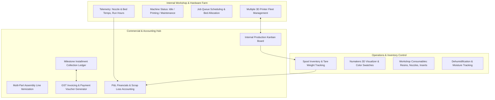

# 🗺️ Made N More & 3D Printing Labs — Master Product Roadmap & Internal Business Blueprint
### Internal Operating System (DMOS) for 3D Printing Business Operations & Print Farm Management
**Document Version:** 3.0 (Operator-Centric Business Architecture)  
**Status:** Active Internal Specification  
**Strategic Focus:** **100% Internal Business Operations** (Client portals moved to distant horizon)  

---

## 🎯 Strategic Direction: Operator-First Business Architecture

> **Primary Objective**: Build a robust, centralized internal management platform exclusively for the business owner and workshop technicians. The system manages hardware fleets, job queues, material inventory, milestone finances, and maintenance without exposing any public-facing portals to outside clients in the initial and growth stages.

---

## 🗓️ Phased Development Roadmap

| Phase | Strategic Domain | Focus Area | Status |
| :---: | :--- | :--- | :---: |
| **Phase 1** | **Commercial Workflow & Billing** | Multi-Item Assemblies, 8-Stage Kanban, GST Invoicing & Milestone Receipts | **✅ DELIVERED** |
| **Phase 2** | **Multiple Printer Farm Interface** | Multi-Printer Fleet Dashboard, Job Scheduling, Machine Telemetry & Maintenance Logs | **🔥 IN PROGRESS** |
| **Phase 3** | **Deep Material & Consumables** | Gram-Level Tare Weights, QR Spool Labels, Resin & Workshop Consumables Registry | **PLANNED** |
| **Phase 4** | **Financial P&L & Scrap Intelligence** | Machine Depreciation, Scrap Loss Accounting, Monthly P&L, Batch Supplier Margins | **PLANNED** |
| **Phase 5** | **Distant Horizon: Client Web Portal** | External Customer Tracking & Public Web Slicing (Deferred until farm exceeds 10 machines) | **DISTANT / DEFERRED** |

---

## 📌 Phase-by-Phase Technical Specifications

---

### ✅ PHASE 1: Production Pipeline & Milestone Billing (DELIVERED)
- **Multi-Part Assembly Itemization**: Grouping complex client assemblies (e.g. Drone arm assembly with ABS, PETG-HS, and TPU parts) under a single master order with automatic subtotal computation.
- **8-Stage Interactive Kanban Board**: From `Draft/Quote` to `Advance Paid`, `Slicing`, `In Queue`, `Printing`, `QA`, `Ready for Dispatch`, and `Settled`.
- **GST Invoicing Engine**: Automated HSN/SAC codes (SAC 9988 & HSN 3916), intra-state (CGST 9% + SGST 9%) vs inter-state (IGST 18%), milestone payment tallies, and clean `@media print` A4 exports.
- **Milestone Payment Receipts**: Individual voucher generator for logging installment percentages (28% deposit, 22% midway, 50% settlement).

---

### 🖨️ PHASE 2: Multiple 3D Printer Fleet Farm Interface (CURRENT FOCUS)

Equip the workshop with a dedicated, real-time control room for managing multiple 3D printers across brands (Snapmaker U1, CoreXY, Bambu Lab, modified bedslingers).

#### 2.1 Multi-Printer Fleet Dashboard (`/#/printers`)
- **Visual Machine Cards**:
  - **Machine Identity**: Name, Model (e.g. *Snapmaker U1 #01*, *Voron CoreXY #02*, *Bambu P1S #03*), Serial/IP address, and build volume ($X \times Y \times Z$).
  - **Live Operational Status**:
    - `🟢 Idle / Ready`: Plate cleared, awaiting next queue item.
    - `🟡 Heating / Bed Leveling`: Reaching target bed/nozzle temperatures.
    - `🔵 Printing`: Actively extruding with elapsed time, remaining time, and progress ring.
    - `🟠 Paused / Filament Runout`: Awaiting operator intervention.
    - `🔴 Maintenance / Nozzle Swap`: Machine offline for servicing.
  - **Thermal Telemetry**: Live indicators for Extruder Temp (Actual vs Target e.g. `245°C / 250°C`) and Heatbed Temp (`80°C / 80°C`).
  - **Assigned Spool**: Quick indicator showing which spool/color from the inventory is currently loaded into the extruder.

#### 2.2 Farm Job Assignment & Queue Dispatcher
- Direct bridge between the **Orders Kanban Board** and the **Printer Fleet**:
  - In Kanban `In Print Queue`, click **"Assign to Printer"** to route a part to an available machine.
  - Assign nozzle diameter (e.g. 0.4mm for fine parts, 0.6mm for high-flow engineering parts).
  - Track estimated vs actual print durations to refine future pricing calculations.

#### 2.3 Machine Health, Operating Hours & Maintenance Logbook
- **Odometer Running Hours**: Cumulative meter tracking total machine operating hours.
- **Preventative Maintenance Reminders**:
  - Nozzle wear replacement interval (alert every 250 hours of abrasive PETG/CF printing).
  - Linear rail and lead screw lubrication alert (every 300 hours).
  - Timing belt tensioning check (every 500 hours).
- **Service History Log**: Date, technician notes, parts replaced, and downtime duration.

---

### 🧵 PHASE 3: Deep Material & Consumable Inventory Control

Move beyond basic spool counts into precise gram accounting, physical barcode tags, and workshop consumables.

#### 3.1 Gram-Level Tare & Net Weight Sync
- **Brand Tare Weight Profiles**:
  - Numakers reusable spool core: 210g
  - eSun cardboard core: 230g
  - Bambu reusable spool: 250g
- **Digital Scale Integration**: Enter gross weight directly; the system deducts tare to give remaining usable grams.

#### 3.2 Spool Barcode & Thermal QR Label Generator
- One-click printing of thermal sticker labels (50x30mm) for every incoming spool with unique QR code.
- Quick webcam/mobile scan to pull up spool stats and log deductions.

#### 3.3 Workshop Consumables & Resins Registry
- Track secondary materials:
  - MSLA/SLA photopolymer resins (ml volume, exposure profiles).
  - Isopropyl Alcohol (IPA 99%) in Liters.
  - Replacement brass & hardened steel nozzles.
  - Brass threaded heat-set inserts (M2, M3, M4, M5 packs).

---

### 📊 PHASE 4: Internal P&L, Scrap Loss & Farm Intelligence

Ensure operational profitability with automated cost allocation and scrap loss accounting.

#### 4.1 Scrap Loss & Failed Print Log
- Dedicated failure logging: When a print fails, log wasted material mass and lost machine hours with failure root cause (bed adhesion, power loss, clogged nozzle, filament tangle).
- Automatically deducts wasted material from inventory and logs loss into the financial ledger.

#### 4.2 Comprehensive Profit & Loss (P&L) Reports
- Monthly, quarterly, and annual breakdown:
  - Gross Revenue from Milestones Collected.
  - Direct Material Costs (Filament consumed + scrap waste).
  - Machine Electricity & Depreciation Reserves.
  - Net Shop Operating Profit Margins.

---

### 🌐 PHASE 5: Distant Horizon — Client Self-Service Portal (DEFERRED)

> [!NOTE]
> **Strategic Timing**: This phase is deliberately deferred until internal farm operations, fleet telemetry, and material accounting are 100% automated and the print fleet scales beyond 10 production machines.

- **Public Order Tracker (`/#/track?order=ID`)**: Read-only progress link for clients to view production stages and photos.
- **Client Web Slicer / 3D Model Quoter**: In-browser Three.js STL volume estimator for self-service client quotation.
- **Integrated Payment Gateway**: Razorpay / Stripe webhook integration for direct credit card / net banking settlements.

---

*Authored for: Made N More Management & 3D Printing Labs Operations*  
*Focus: 100% Internal Operational Excellence*
